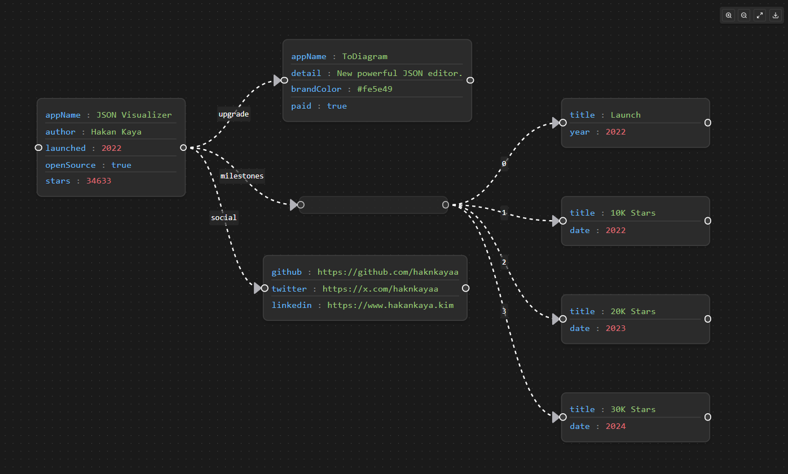

# JSON Visualizer for Visual Studio Code

A Visual Studio Code extension that provides interactive visualization for JSON data, allowing you to see your JSON structures as beautiful, interactive diagrams. Perfect for understanding complex JSON structures, API responses, and configuration files.

## Features

- 🎯 **Interactive Visualization**: Convert JSON data into interactive node-based diagrams
- 🎨 **Beautiful Design**: Modern, dark-themed interface with smooth animations
- 🔍 **Zoom Controls**: Easily zoom in/out and fit view to your content
- 📸 **Export as Image**: Save your visualizations as high-quality PNG images
- 🖱️ **Drag & Drop**: Rearrange nodes to customize your view
- 🎮 **Keyboard Controls**: Full keyboard navigation support
- 🌙 **Dark Theme**: Optimized for VS Code's dark theme

## Quick Start

1. Install the JSON Visualizer extension from VS Code Marketplace
2. Open any JSON file in VS Code
3. Right-click and select "Visualize JSON" or use the command palette
4. Start exploring your JSON structure visually!

## Commands

Open the Command Palette (Command+Shift+P on macOS and Ctrl+Shift+P on Windows/Linux) and type in one of the following commands:

| Command | Description |
|---------|-------------|
| `JSON Visualizer: Visualize Current File` | Create visualization from current JSON file |
| `JSON Visualizer: Export as PNG` | Save current visualization as PNG image |
| `JSON Visualizer: Reset View` | Reset the visualization to default view |

## Usage

### Basic Usage
1. Open a JSON file
2. Use the command palette or context menu to visualize
3. Interact with the diagram:
   - Drag nodes to rearrange
   - Scroll to zoom
   - Click and drag background to pan
   - Use control buttons for quick actions

![Basic Usage]

### Export Feature
Save your visualizations as high-quality PNG images:
1. Click the download button in the controls
2. Choose save location
3. Get your visualization as a PNG file

![Export Feature]

## Requirements

- Visual Studio Code version 1.60.0 or higher
- Modern web browser support
- No additional dependencies required

## Extension Settings

This extension contributes the following settings:

* `jsonVisualizer.theme`: Select visualization theme (default: "dark")
* `jsonVisualizer.defaultZoom`: Set default zoom level (default: 1)
* `jsonVisualizer.animationSpeed`: Control animation speed (default: "normal")

## Known Issues

See our [GitHub issues](https://github.com/haknkayaa/JSONVisualizerForVSCode/issues) for any known issues.

## Release Notes

### 1.0.0
- Initial release of JSON Visualizer
- Basic visualization features
- Export functionality
- Interactive controls

## Contributing

Contributions are always welcome! Please see our [contributing guide](CONTRIBUTING.md) for details.

## License

This extension is licensed under the [MIT License](LICENSE).

## Privacy and Telemetry

The JSON Visualizer extension does not collect any personal data or telemetry. Your JSON data remains local to your machine and is never transmitted anywhere.

## Support

If you have any questions or feedback:
- File an issue on our [GitHub repository](https://github.com/haknkayaa/JSONVisualizerForVSCode/issues)
- Contact: mail@hakankaya.kim

---

**Enjoy visualizing your JSON data!** 🎉