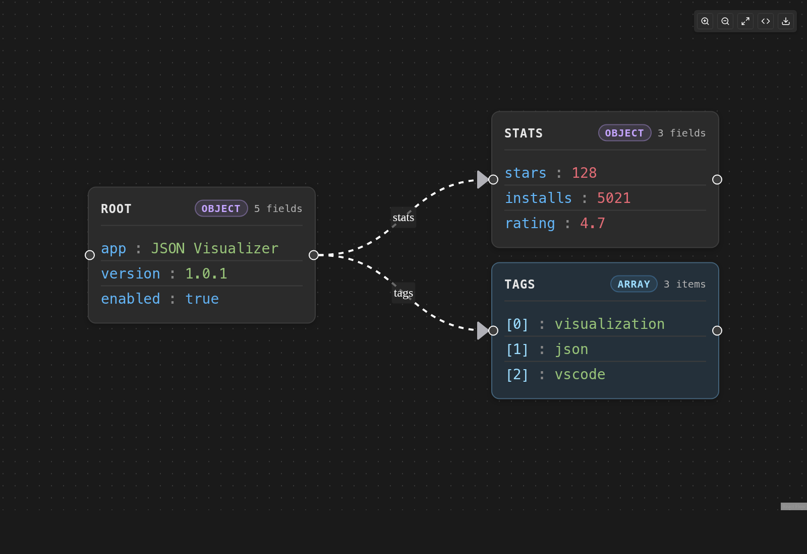
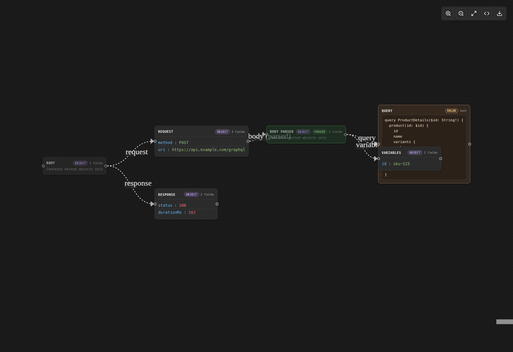

# JSON Visualizer

Visualize JSON files as interactive node graphs directly inside VS Code.

JSON Visualizer helps you inspect nested payloads faster, expand escaped JSON strings in place, and export the result when you need to share or document a structure.

## Features

- Open a graph view for any `.json` file from the editor title bar
- Explore nested objects and arrays with a zoomable, pannable layout
- Parse escaped JSON strings without leaving the preview
- Hide, unhide, collapse, and expand nodes from the node context menu
- Export the current graph as `PNG`
- Export the current structure as `YAML`

## Quick Start

1. Install `JSON Visualizer` from the VS Code Marketplace.
2. Open any `.json` file in VS Code.
3. Click `Preview JSON` in the editor title bar.
4. Explore the graph and use the controls to zoom, fit, or export.

You can also open the preview from the Command Palette with `Preview JSON`.

## Screenshots

Basic object visualization:

Deep nested data:

Escaped JSON parsed inside the preview:

## Typical Workflow

1. Open a JSON document.
2. Launch `Preview JSON`.
3. Move around the graph with pan and zoom controls.
4. Right-click nodes to simplify the view.
5. Expand string values that contain nested JSON.
6. Export the final result as `PNG` or `YAML`.

## Requirements

- VS Code `1.96.0` or newer

## Commands

- `Preview JSON`: Open the visual preview for the active JSON file

## Privacy

JSON Visualizer does not send your JSON anywhere. Rendering, parsing, and exports stay local in VS Code.

## Support

- Report an issue: [GitHub Issues](https://github.com/haknkayaa/JSONVisualizerForVSCode/issues)
- Request a feature: [New feature request](https://github.com/haknkayaa/JSONVisualizerForVSCode/issues/new?title=Feature%3A+)

## Development

Development notes, local setup, and test commands live in [docs/development.md](docs/development.md).

## License

[MIT](LICENSE)
